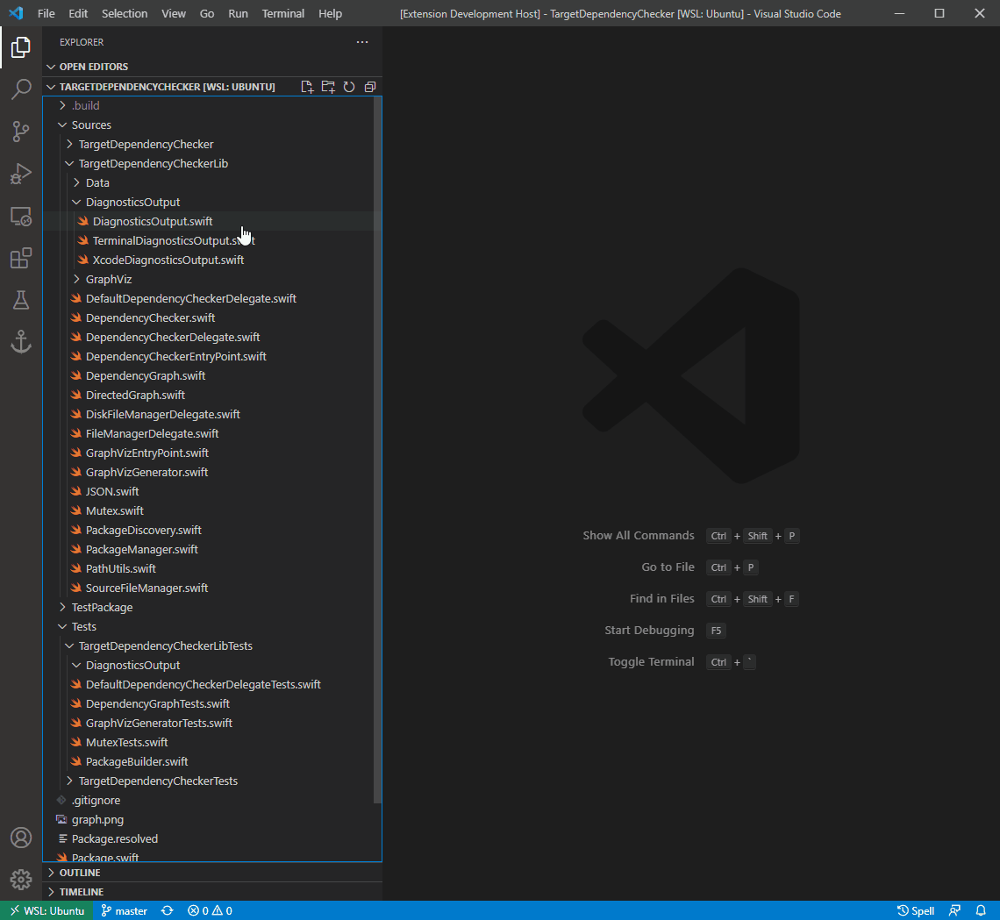

# SwiftTestFileGen for Visual Studio Code

An extension for Visual Studio Code that adds a shortcut for generating test files for Swift Package Manager projects.

## Features

From a set of .swift files selected, right click and choose 'Generate Test File(s)'.

## Requirements

A Swift 5.4 or later installation.

## Extension Settings

This extension contributes the following settings:

| `swiftTestFileGen.fileGen.confirmation` | When to trigger a confirmation of the operation through a Refactor Preview window |
|---|---|
| Configuration | Description |
| `always` | Always requests confirmation of changes |
| `onlyIfMultiFile` | Only requests confirmation if more than one file is selected, or if the selected item is a directory |
| `onlyOnDirectories` | Only requests confirmation if the selection contains one or more directories |
| `never` | Never requests confirmation; always create test files straight away |

## Known Issues

A Package.swift is required on the workspace for the extension to find source and test files properly.

## Release Notes

### 0.0.1

Initial release
